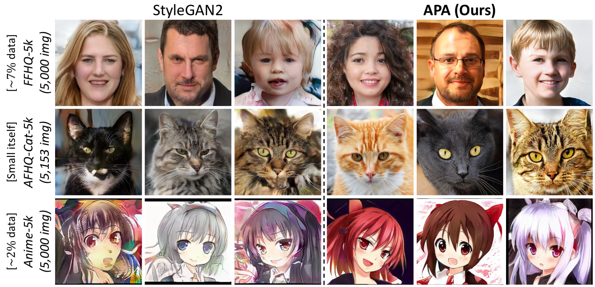
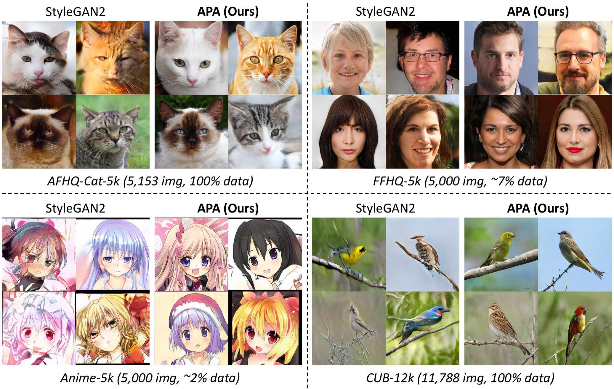

# Deceive D: Adaptive Pseudo Augmentation for GAN Training with Limited Data (NeurIPS 2021)



This repository will provide the official PyTorch implementation for the following paper:

**Deceive D: Adaptive Pseudo Augmentation for GAN Training with Limited Data**<br>
[Liming Jiang](https://liming-jiang.com/), [Bo Dai](http://daibo.info/), [Wayne Wu](https://wywu.github.io/) and [Chen Change Loy](https://www.mmlab-ntu.com/person/ccloy/)<br>
In NeurIPS 2021.<br>
[**Project Page**](https://www.mmlab-ntu.com/project/apa/index.html) | [**Paper**](https://liming-jiang.com/projects/APA/resources/paper.pdf) | [**Poster**]() | [**Slides**](https://liming-jiang.com/projects/APA/resources/slides.pdf) | [**YouTube Demo**](https://www.youtube.com/watch?v=3Luz817WpZM)
> **Abstract:** *Generative adversarial networks (GANs) typically require ample data for training in order to synthesize high-fidelity images. Recent studies have shown that training GANs with limited data remains formidable due to discriminator overfitting, the underlying cause that impedes the generator's convergence. This paper introduces a novel strategy called Adaptive Pseudo Augmentation (APA) to encourage healthy competition between the generator and the discriminator. As an alternative method to existing approaches that rely on standard data augmentations or model regularization, APA alleviates overfitting by employing the generator itself to augment the real data distribution with generated images, which deceives the discriminator adaptively. Extensive experiments demonstrate the effectiveness of APA in improving synthesis quality in the low-data regime. We provide a theoretical analysis to examine the convergence and rationality of our new training strategy. APA is simple and effective. It can be added seamlessly to powerful contemporary GANs, such as StyleGAN2, with negligible computational cost.*

https://user-images.githubusercontent.com/27750093/141257021-4c2aa617-3274-4b82-9577-6913d19d8a20.mp4

## Updates

- [09/2021] The [paper](https://liming-jiang.com/projects/APA/resources/paper.pdf) of APA is accepted by **NeurIPS 2021**.

## Code Release Date

Our code will be made publicly available **by the end of this month (November 2021)**. Please stay tuned.

## Results

### Effectiveness on Various Datasets



### Effectiveness Given Different Data Amounts


### Overfitting and Convergence Analysis


### Comparison with Other State-of-the-Art Solutions


### Higher-Resolution Examples (1024 × 1024) on FFHQ-5k (~7% data)


## Citation

If you find this work useful for your research, please cite our paper:

```
@inproceedings{jiang2021DeceiveD,
  title={{Deceive D: Adaptive Pseudo Augmentation} for {GAN} Training with Limited Data},
  author={Jiang, Liming and Dai, Bo and Wu, Wayne and Loy, Chen Change},
  booktitle={NeurIPS},
  year={2021}
}
```

## License

Copyright (c) 2021. All rights reserved.
